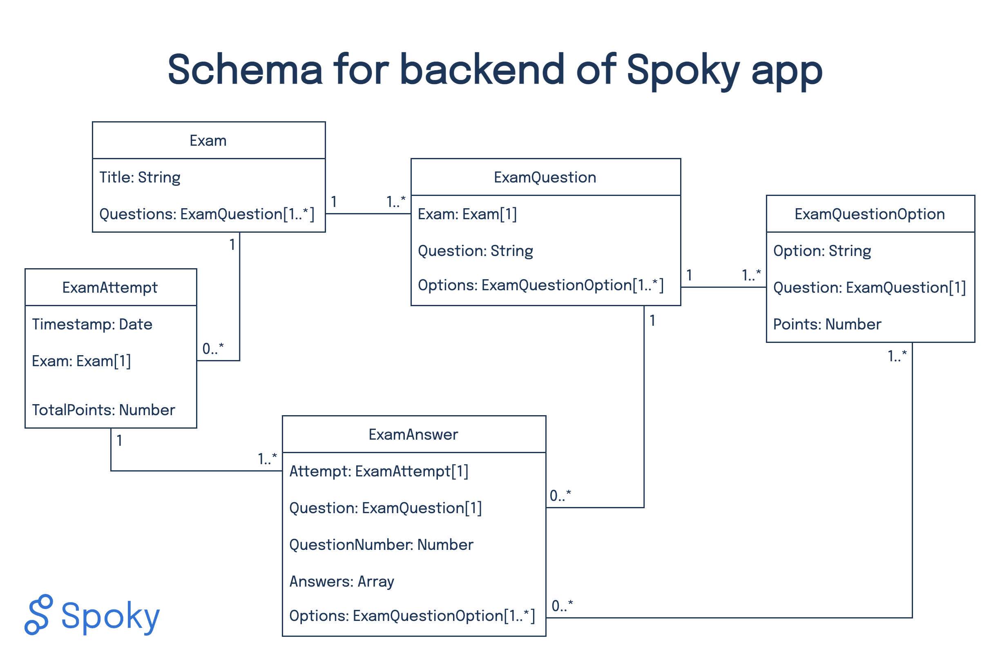

# Backend

## Technology

https://parseplatform.org/

https://github.com/parse-community/parse-dashboard

## Description

At the time of project handover we have implemented the feature of taking a single-option multiple-choice exam in the **app**. This is the main focus of the parse schema, while some future extensions are already supported. The schema is described and illustrated below, and conveniently stored as a json file  here, such that it could be created using the .

New exam questions should be created by using the functionality provided in the Settings tab of the app, to ensure all relations and pointers are set correctly. Another functionality provided there is to calculate and upload the total number of points achieved in the last set of answers submitted. These are some pre-functions for the **dashboard** (see Roadmap).

Future extentions already supported:
- mutli-option multiple-choice questions
  - there should always be an option "none", as at least one option must be selected

Next steps not yet included:
- users and roles
- exam properties
  - duration, and other metadata
  - in particular, time periods for exam download, availability and upload
- top-level structure such as hubs, terms and courses

## Schema

There are three classes, covering **exams** consisting of several **questions** each with multiple **options**. These **exams** can be solved in **attempts** for which the chosen **answers** are submitted to the backend.

### Special features
- The questions and options for one attempt are randomized in the app at the start of the attempt, as an anti-cheating measure. The actual *question number* after randomization is stored along with the answers to ensure students can correctly refer to a specific question in the case of problems or inspections after grading.
- To have each set of answers in a complete form, the objectId of each question is stored, as well as both the text value and objectId of all the selected answers.
- In the app, the points are never queried with the exam questions.
- Validation is performed by summing the points of all selected options. This way, wrong answers can either have 0 points, or even negative points.
  - The formula for calculating the total points could be extended to include penalties for skipped questions.

All fields are required, except for the *total points* of an **attempt**, which can only be calculated later (exam answer validation by professor).

