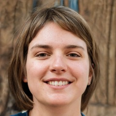

# Educator persona

<table>
<tbody>
<tr>
  <td>
    
  </td>
  <td>
    Name: Monika 
    Age: 27 
    Location: Geneva 
    Occupation: Phd student in Economics
  </td>
</tr>
<tr>
  <td colspan="2">
    <i>"This experience was enriching, since I had the opportunity to exchange ideas with outstanding students in the refugee camp in Kakuma."</i>
  </td>
</tr>
</tbody>
</table>

## About

Monika is a Tutor for the Global Poverty Course. This is her second year as an Online Tutor for the InZone team.

## Behaviours

- Meets weekly with the students on an instant messaging board
- Poses questions on the communication forum in written or video form
- Likes to encourage students to discuss new topics and concepts
- Promotes collaborative learning
- In case of Plagiarism and cheating, she has to report it

## Needs and Goals

- Wants to help students to improve education, financing, and entrepreneurial conditions in the camp.
- Needs to keep all communication between herself and the students in a common forum, so that everyone can benefit from the exchange.
- Needs a system that would allow students to take exams remotely in a safe & easy way following the rules of the University
- Prevent and detect cheating during exams
- Needs a two way system that would allow her to provide and get feedback from students
- Needs ways to keep students motivated

## Challenges

- Connectivity is poor at the camp
- Power outs are very frequent
- Some concepts are challenging to explain through a simple WhatsApp discussion
- WhatsApp is not fit to transfer data
- There is a level of cheating during exams
- Language barrier
- Being aware of cultural differences
- Teaching over WhatsApp takes a lot more time. She has other responsibilities with her own studies

