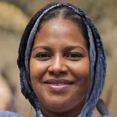

# Student persona

<table>
<tbody>
<tr>
  <td>
    
  </td>
  <td>
    Name: Amina 
    Age: 26 
    Location: Kakuma 
    Occupation: She is a mom
  </td>
</tr>
<tr>
  <td colspan="2">
    <i>"It can feel lonely studying behind a screen."</i>
  </td>
</tr>
</tbody>
</table>

## About

Amina and her family are stranded at a refugee camp for 2 years that hosts close to 180.000 people. She has two children 4 and 5 years old. Life is very hard and overwhelming at the camp. She aspires to improve her family’s livelihood and therefore studies Humanitarian Interpreting through the InZone programme. She has basic English knowledge. 

## Behaviours

- Studies, in the evenings or weekends whenever she has time
- It takes her around 45 minutes to walk to the Hub 
- Has her own smartphone 
- Needs to spend an average of 250 hours behind a screen
- Communicates with her tutors through WhatsApp
- Enjoys her studies 

## Needs and Goals

- Wants to get a degree to improve hers and her family’s livelihood
- Aspires to move to Europe with her family
- After her studies she would like to help her community/ other people in the same situation
- Would like to get a job in her field 
- Likes to keep herself busy in the camp
- Wishes the exam system was easier
- Needs a better way to communicate with her tutors 
- Needs a way to provide feedback for the course

## Challenges

- Internet connectivity is poor
- Power outs are very frequent
- Study resources are limited
- The learning Hub can barely accommodate 12 students at a time
- She has limited time to study
- Concerned that a lot of her classmates are dropping out
- Sometimes feels alone behind the screen 
- Struggling to process the content of the course 
- Struggles with language limitations 
- Since the hub is far away, it is not safe to walk there alone after dark

---

## Sources

Image source: https://thispersondoesnotexist.com/

