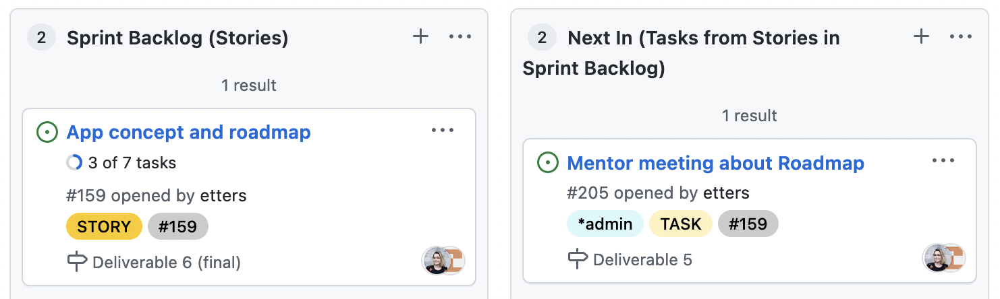

# Concept and project resources of spoky

## Resources in this folder

In this folder you can find the two [personas](/docs/concept/personas) created:
- [Student persona](/docs/concept/personas/student.md)
- [Educator persona](/docs/concept/personas/educator.md)

Also, we are sharing some of the [user flows](/docs/concept/user-flows) created during the preparation:
- [Taking an exam](/docs/concept/user-flows/user-flow-take-exam.png)
  - and editable here: https://app.diagrams.net/?mode=github#HWomenPlusPlus%2Fdeploy-impact-21-inzone-a%2Fmain%2Fdocs%2Fconcept%2Fuser-flows%2Fuser-flow-take-exam.drawio
- [Creating an exam](/docs/concept/user-flows/user-flow-create-exam.png)
  - and editable here: https://app.diagrams.net/?mode=github#HWomenPlusPlus%2Fdeploy-impact-21-inzone-a%2Fmain%2Fdocs%2Fconcept%2Fuser-flows%2Fuser-flow-create-exam.drawio
- [Login and verification](/docs/concept/user-flows/user-flow-login.png)
  - and editable here: https://app.diagrams.net/?mode=github#HWomenPlusPlus%2Fdeploy-impact-21-inzone-a%2Fmain%2Fdocs%2Fconcept%2Fuser-flows%2Fuser-flow-login.drawio

We sketched all of our ideas in a [high-level concept](/docs/concept/high-level-concept.png) (editable version here: https://app.diagrams.net/?mode=github#HWomenPlusPlus%2Fdeploy-impact-21-inzone-a%2Fmain%2Fdocs%2Fconcept%2Fhigh-level-concept.drawio):

We have also created some [workflow guidelines](/docs/concept/workflow-guidelines.md) for team alignment and wrote down a shared [team vision](#teamvision). For better filtering of the [project board](#board) on github we developed a script to add labels.

<a name="teamvision"><h2>Team vision</h2></a>

### learning
We are here to learn new tools we have not used before, and new applications of tools already known to us. We collaborate and learn from each other. We connect with the mentors and benefit from their knowledge.

### product cycle
We are excited to experience a full product cycle where we observe putting methodologies we have only read about into action, and where we see how design meets development.

### impact
We strive to have an impact on refugee education opportunities. We empathise to understand their pain points, research their situation, and explore multiple solutions.

### focus
We focus on creating a minimal loveable product that adds value to the students and is doable within our project's scope.

<a name="board"><h2>Project board</h2></a>

The [task lists](https://docs.github.com/en/issues/tracking-your-work-with-issues/about-task-lists) available for github issues are very convenient to track a set of tasks grouped together as one story. All the single tasks, and the story they belong to, can be separate issues. On the project board, the completed tasks from the list are shown as "4 of 7 tasks" for the story. However, for a given tasked it is not visible on the board in which story it is tracked: one has to open the issue for this. Upon mentor input we therefore created labels: for each story tracking tasks as issues, we made a label "#x" with x the story's issue number, and assigned this label to both the story and all tracked tasks. This allows for easy filtering of the board, which can be done by simply clicking on this label. To simplify adding these labels, a python script was created (to be run locally on your computer, see below).

The result looks like this:

### Auto labeling script

The script can be found [here](/docs/concept/scripts/auto_label.py). For this to run you need to install the [GitHub CLI](https://cli.github.com/) and ``python3``.

Future extensions would be to use issue templates, and to program some github actions to take care of this labeling whenever issues are edited.
